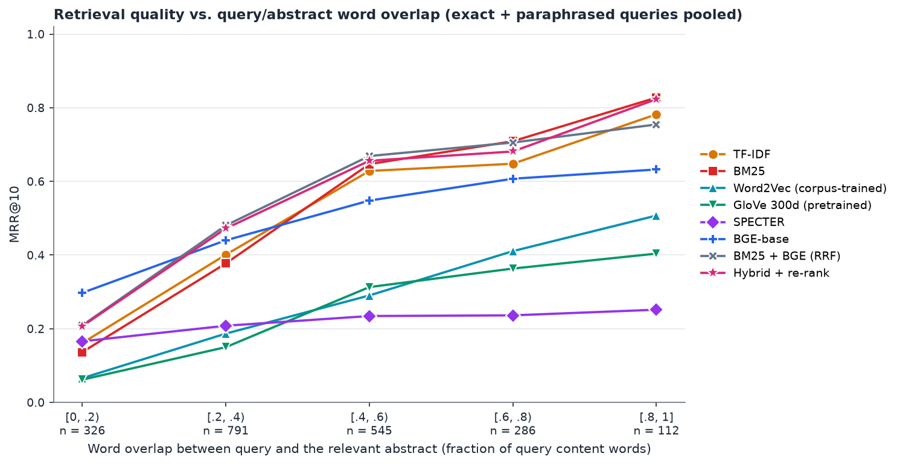
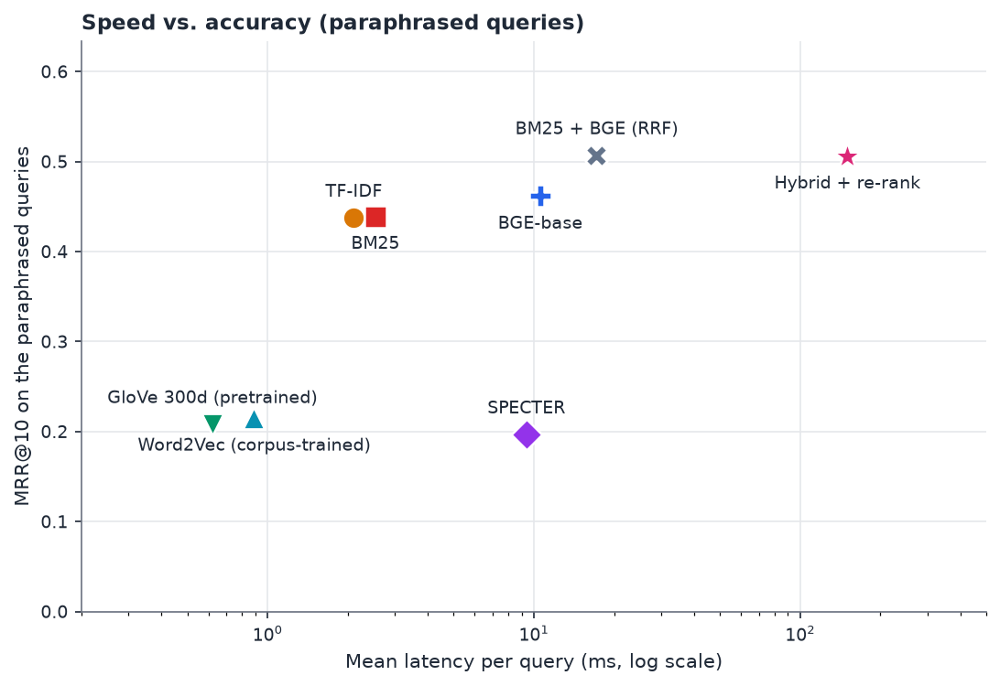
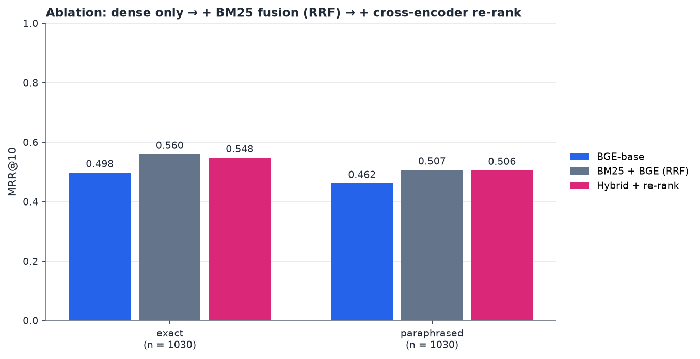

# ScholarSense: does semantic search close the vocabulary gap?

> **DRAFT STATUS (delete this box before submitting).**
> Every number below comes from `results/summary.json`, `results/summary.md`, `results/significance.json`,
> `results/leak_check.json` or `results/evaluation_design.md` (P3's run on an RTX 4050 laptop GPU), except where marked
> **TBD**. Open items:
> - **TBD-HW:** the hand-written column (section 5.2). P3 has to re-run `python eval/run_eval.py --sets handwritten`
>   and `python eval/charts.py` now that `eval/data/queries_handwritten.jsonl` exists, then send the new `summary.md`.
> - **TBD-FINAL:** if P3's final numbers differ from the ones copied here, update sections 5 and 8.
> - **TBD-PRF:** section 5.4 (query expansion, `bm25_prf`) uses numbers from P5's own run, not from P3's `summary.json`.
>   Once P3 re-runs the evaluation with `bm25_prf` available, replace them with the official ones.
> - Section 6 (aspect search) is qualitative on purpose; see 6.4 for why it has no accuracy number.
>
> For checking P3's new run: P5's own scratch run of the same query files and metric reproduced P3's BM25 and TF-IDF
> numbers exactly. On the 20 hand-written queries it gave MRR@10 / Recall@10 of TF-IDF 0.400 / 0.453, BM25 0.407 / 0.503,
> Word2Vec 0.408 / 0.324, GloVe 0.379 / 0.358, SPECTER 0.387 / 0.418, BGE 0.900 / 0.868, BM25 + BGE (RRF) 0.738 / 0.719,
> Hybrid + re-rank 0.818 / 0.750, BM25 + query expansion 0.498 / 0.525. P3's official numbers should match these. If they
> do, section 5.2 and the hand-written part of the conclusion can be filled with them.

---

## 1. Introduction and research gap

Keyword search finds a paper only if the query and the abstract share words. People rarely write queries in a
paper's own words. This is the **vocabulary mismatch problem**.

> Example: a user searches for *"automatic translation of spoken language"*. A paper on *speech-to-speech
> translation* is exactly what they want, but it may share few of the query's words.

Our corpus has the same problem in miniature. The query *"figuring out how far away everything is in a picture
taken by a camera with a 360-degree view"* is answered by three papers on omnidirectional depth estimation. TF-IDF
and BM25 do not rank any of them in the top 5. BGE, a modern embedding model, ranks two of them 1st and 2nd.

**Research question.** Do semantic retrieval methods (word vectors, transformers) solve vocabulary mismatch better
than keyword search, and by how much? We also ask what a hybrid of the two adds, and whether searching only the
*problem* or *result* sentences of an abstract (aspect search) helps.

The case study is inspired by Scholar Inbox. Scholar Inbox itself uses GTE-Large embeddings with a recommendation
model; we do not reproduce that system.

## 2. Dataset

We use `abstract_sentences.csv`, released with the Scholar Inbox paper.

| Fact | Value |
|---|---|
| Rows (labelled spans) | 2,538 |
| Unique abstracts (papers) | 727 |
| Labels | `idea` 678, `task` 664, `result` 652, `problem` 544 |
| Papers with no arXiv ID | 18 |
| Abstract length | median 168 words, max 297 |
| Topic | mostly computer vision (375 abstracts mention "image" or "images"); NLP topics are rare (1 mention of "machine translation") |

Each row marks one span of an abstract with character offsets (`start_idx`, `end_idx`) and a label. We call the
`idea` label **method** in the interface.

**Data problems we found and fixed** (all in `data.py`):

1. **Float arXiv IDs.** Reading `arxiv_id` as a number turns `2101.06860` into `2101.0686`. This corrupted **60 papers**.
   We read the column as text.
2. **Dirty spans.** 568 of 2,538 spans (22.4%) start or end in the middle of a word (for example "To address th"),
   and 13 rows start after the end of the abstract. `clean_span` moves the offsets to word boundaries, drops spans
   with fewer than four words, and removes exact duplicates. This leaves **2,339 clean spans**.
3. **Identity.** Papers are identified by `doc_index` (position in the corpus), never by arXiv ID, because 18 papers
   have none.

After cleaning, the number of papers with at least one span is: task 501, problem 535, method 668, result 635.
Almost every paper has exactly one span of each aspect.

## 3. Methods

Eight retrieval methods plus aspect search, in four families.

| Family | Method | How it works |
|---|---|---|
| Lexical | **TF-IDF** | Sparse bag of lemmatised words, weighted by rarity; cosine similarity. |
| Lexical | **BM25** | Keyword scoring with term-frequency saturation and length normalisation (k1 = 1.5, b = 0.75). Same tokens as TF-IDF, so the two are directly comparable. |
| Lexical | **BM25 + query expansion** (extra) | BM25, then the 10 most characteristic words of the top 5 results are added to the query and the search is repeated (pseudo-relevance feedback). Tests whether keyword search can simply be patched (section 5.4). |
| Static semantic | **Word2Vec (corpus-trained)** | Skip-gram vectors learned from only these 727 abstracts (PyTorch, 100 dimensions, 5 epochs); a document is the average of its word vectors. |
| Static semantic | **GloVe 300d (pretrained)** | Average of pretrained GloVe vectors (6 billion tokens). Contrasts with Word2Vec: same idea, far more training text. |
| Contextual | **SPECTER** | Transformer trained on citation links between scientific papers. |
| Contextual | **BGE-base** | `BAAI/bge-base-en-v1.5`, a modern dense retriever. Queries get BGE's search instruction prefix; abstracts do not. |
| Hybrid | **BM25 + BGE (RRF)** | Reciprocal Rank Fusion of the BM25 and BGE top-100 lists (`score = sum of 1 / (60 + rank)`). |
| Hybrid | **Hybrid + re-rank** | The RRF top-30 is re-scored by a cross-encoder (`ms-marco-MiniLM-L6-v2`). |

The hybrid pipeline:

```
Query ─┬─► BM25 top-100 ─┐
       │                  ├─► Reciprocal Rank Fusion ─► top-30 ─► cross-encoder re-rank ─► top-k
       └─► BGE  top-100 ─┘
```

`BM25 + BGE (RRF)` stops after the fusion step. We keep it as a separate method so we can measure what each stage adds
(the ablation in section 5.3).

**Aspect search** (section 6) is a separate component. It searches only the sentences labelled *task*, *problem*,
*method* or *result*, and shows which sentence matched.

All methods implement one interface (`fit(abstracts)`, `search(query, k)`), so the interface, the evaluation and the
web app treat them the same way.

## 4. Evaluation design

**Queries.** The task and problem spans in the dataset are short natural descriptions of what a paper is about, so we
use them as queries. The correct answer is the paper the span came from. After cleaning, this gives **1,030 queries**.

**The leak, and why we mask the corpus.** Every span is copied word for word from its own abstract. Searching the
original abstracts rewards any method that matches the copied text. We measured it (MRR@10, exact queries):

| Method | Original abstracts | Masked corpus |
|---|---:|---:|
| TF-IDF | 0.962 | 0.519 |
| BM25 | 0.972 | 0.523 |
| BGE-base | 0.766 | 0.498 |

So the exact and paraphrased queries are searched in a **masked corpus**: every abstract with all of its task and
problem spans removed. The paper can still be found from its method and result sentences.

**Query sets.**

| Set | Queries | Corpus | What it tests |
|---|---:|---|---|
| exact | 1,030 | masked | Spans as written. Keeps the full word overlap with the rest of the paper. |
| paraphrased | 1,030 | masked | The same spans, back-translated English → German → English (Helsinki-NLP Marian models, beam search of 4). Changes the wording but keeps the meaning, which recreates vocabulary mismatch. |
| hand-written | 20 | full | Plain-language queries, written without the papers' technical terms, with the relevant papers marked by hand. They are not taken from the abstracts, so no masking is needed. |

**Metrics.** **MRR@10** is 1 / (rank of the first correct paper) if it is in the top 10, else 0, averaged over queries.
**Recall@10** is the share of correct papers found in the top 10. **Latency** is the mean and 95th percentile of a
single-query search on the full corpus, over 200 queries after 5 warm-up queries.

**Hardware.** NVIDIA GeForce RTX 4050 Laptop GPU (CUDA), as recorded in `results/summary.json`. The team brief expected
an RTX 4060.

**Uncertainty.** `results/significance.json` gives a 95% confidence interval for the difference in MRR@10 between method pairs
(paired bootstrap over queries, 10,000 resamples, fixed seed). We call a gap significant only if the interval excludes zero.

## 5. Results

### 5.1 Main table (exact and paraphrased queries, masked corpus)

From `results/summary.md`. Bold = best in the column (highest accuracy, lowest latency).

| Method | exact MRR@10 | exact R@10 | paraphrased MRR@10 | paraphrased R@10 | Latency mean (ms) | Latency p95 (ms) |
|---|---:|---:|---:|---:|---:|---:|
| TF-IDF | 0.519 | 0.710 | 0.438 | 0.647 | 2.1 | 3.3 |
| BM25 | 0.523 | 0.704 | 0.439 | 0.624 | 2.5 | 5.8 |
| Word2Vec (corpus-trained) | 0.272 | 0.433 | 0.215 | 0.362 | 0.9 | 1.4 |
| GloVe 300d (pretrained) | 0.237 | 0.409 | 0.208 | 0.363 | **0.6** | **0.8** |
| SPECTER | 0.233 | 0.395 | 0.197 | 0.346 | 9.4 | 11.0 |
| BGE-base | 0.498 | 0.711 | 0.462 | 0.666 | 10.6 | 18.2 |
| BM25 + BGE (RRF) | **0.560** | 0.757 | **0.507** | 0.708 | 17.2 | 34.7 |
| Hybrid + re-rank | 0.548 | **0.766** | 0.506 | **0.717** | 150.5 | 200.7 |

What the table says:

1. **Keyword search is hard to beat on these queries.** BM25 and TF-IDF match or beat BGE on exact queries (BM25 − BGE
   = +0.025, 95% CI [+0.001, +0.049], just significant). On paraphrased queries BGE is ahead by +0.023, but the interval
   [−0.003, +0.048] includes zero, so we **cannot claim** that BGE beats BM25 on the paraphrased set as a whole.
2. **BM25 and TF-IDF are statistically tied** (difference +0.004 exact and +0.002 paraphrased; both intervals include zero).
3. **The older semantic methods are far behind.** Corpus-trained Word2Vec, pretrained GloVe and SPECTER all score
   0.20 to 0.27. BGE beats SPECTER by +0.265 on both sets (significant). SPECTER is trained to compare whole papers,
   not to answer short queries, which is a likely reason; we did not test it.
4. **Training on 727 abstracts is not worse than 6 billion tokens here.** Word2Vec beats GloVe on exact queries
   (GloVe − Word2Vec = −0.035, significant) and the two are tied on paraphrased queries (−0.007, not significant).

### 5.2 Hand-written queries (full corpus)

**TBD-HW.** The 20 hand-written queries exist (`eval/data/queries_handwritten.jsonl`) but P3's published run
predates them. Fill this table from the new `results/summary.md`:

| Method | hand-written MRR@10 | hand-written R@10 |
|---|---:|---:|
| TF-IDF | TBD | TBD |
| BM25 | TBD | TBD |
| Word2Vec (corpus-trained) | TBD | TBD |
| GloVe 300d (pretrained) | TBD | TBD |
| SPECTER | TBD | TBD |
| BGE-base | TBD | TBD |
| BM25 + BGE (RRF) | TBD | TBD |
| Hybrid + re-rank | TBD | TBD |

How the queries were made: 20 queries in plain language, each with 1 to 6 relevant papers. Candidates came from
TF-IDF, BM25, SPECTER, BGE, the hybrid and keyword scans over all 727 abstracts. The relevant papers were chosen by
reading their abstracts, and a paper is marked relevant only if its main topic answers the query. Each query's `notes`
field records near-misses that were left out. One person (P5) did the labelling.

### 5.3 Overlap, speed and the ablation

**Word overlap** (`results/overlap_vs_mrr.png`). We pool the exact and paraphrased queries (2,060) and group them by
the share of the query's content words that appear in the relevant abstract. The bins hold 326, 791, 545, 286 and 112
queries, from lowest to highest overlap.



From the highest-overlap bin [0.8, 1] to the lowest [0, 0.2):

| Method | MRR@10 at overlap [0.8, 1] | MRR@10 at overlap [0, 0.2) |
|---|---:|---:|
| TF-IDF | 0.78 | 0.16 |
| BM25 | 0.83 | 0.14 |
| BGE-base | 0.63 | 0.30 |
| Hybrid + re-rank | 0.82 | 0.21 |

This is the vocabulary-mismatch result: keyword methods lose most of their accuracy when overlap is low, while BGE
loses much less. BGE is the best single method in the lowest bin and loses to BM25 in the high-overlap bins. Caveat:
low-overlap queries are also shorter and more generic, so this chart mixes "vocabulary mismatch" with "harder query".

**Speed versus accuracy** (`results/speed_vs_accuracy.png`). TF-IDF and BM25 take 2 to 3 ms per query, BGE about 11 ms,
RRF fusion 17 ms and re-ranking 150 ms.



**Ablation** (`results/ablation.png`): BGE → add BM25 by RRF → add the cross-encoder.



| Step | exact MRR@10 | paraphrased MRR@10 | Significant? |
|---|---:|---:|---|
| BGE-base | 0.498 | 0.462 | n/a |
| + BM25 (RRF) | 0.560 (+0.062) | 0.507 (+0.046) | Yes, both sets |
| + cross-encoder re-rank | 0.548 (−0.012) | 0.506 (−0.001) | No, both within noise |

- **Fusion is the best idea in the project.** RRF beats BGE (+0.062 exact, +0.046 paraphrased) and BM25 (+0.037 exact,
  +0.068 paraphrased). All four gaps are significant.
- **Re-ranking did not help.** It makes a query about 9 times slower (150 ms against 17 ms) and gives no average gain.
  It does raise Recall@10 slightly (0.766 against 0.757 exact, 0.717 against 0.708 paraphrased).

### 5.4 Can keyword search simply be patched? Query expansion

A natural objection is that keyword search could be fixed with query expansion instead of switching to semantic models.
`BM25 + query expansion` does this: it runs BM25, treats the top 5 papers as relevant, adds their 10 words with the
highest frequency × IDF that are not already in the query, and searches again (original words counted twice, new words
once). The weights are the ones in the project brief and were **not tuned** on the evaluation queries.

**TBD-PRF:** these numbers come from P5's own run of the same query files, corpora and metric as P3's (it reproduced
P3's BM25 numbers exactly), not from `results/summary.json`. Replace them with P3's once it includes this method.

| Query set | BM25 MRR@10 | BM25 + expansion MRR@10 | Difference (95% CI) | BM25 R@10 | + expansion R@10 |
|---|---:|---:|---|---:|---:|
| exact (1,030, masked) | 0.523 | 0.411 | −0.113 [−0.130, −0.095], significant | 0.704 | 0.702 |
| paraphrased (1,030, masked) | 0.439 | 0.348 | −0.091 [−0.108, −0.075], significant | 0.624 | 0.612 |
| hand-written (20, full) | 0.407 | 0.498 | +0.091 [−0.038, +0.221], not significant | 0.503 | 0.525 |

Expansion **lowers MRR@10 clearly** on the 1,030-query sets while Recall@10 stays about the same. The right paper is still
found, but it is pushed down the list, because the added words come from the top 5 results, and these are often not the
right papers (query drift). For example the query *"making blurry photos sharp again"* has three off-topic papers among
its first-pass top 5, so besides a useful word (*deblurring*) it adds *caricature*, *exaggeration* and *tourist*. On the
20 hand-written queries expansion looks
better, but that set is too small to be sure (the interval includes zero). So **a simple fix of keyword search does not
close the gap**, at least not with the standard recipe.

## 6. Aspect search

### 6.1 What it is

The dataset labels sentences of each abstract as **task** (what the paper sets out to do), **problem** (what is hard or
broken), **method** (the idea, labelled `idea` in the data) or **result**. Aspect search lets the user search only one of
these parts. A query like *"results look unrealistic or contain visible artifacts"* can then be matched against what
papers say their *problem* is, instead of against everything in the abstract.

### 6.2 How it works

1. Every cleaned span is embedded with BGE (no query prefix) and cached.
2. A query is embedded with BGE's query prefix.
3. The query is compared with every span of the chosen aspect (dot product of normalised vectors, so cosine).
4. Each paper keeps its **best** span; the top-k papers are returned with that span's character offsets, so the
   interface can highlight it inside the abstract.

An unknown aspect raises an error; the API turns it into an HTTP 400. The code is `searchers/aspect.py`.

### 6.3 Coverage

| Aspect | Papers with at least one span |
|---|---:|
| task | 501 |
| problem | 535 |
| method | 668 |
| result | 635 |

About a third of papers have no task span and a quarter have no problem span, so these two aspects cannot find
every paper. (727 papers in total.)

### 6.4 Three demo queries

These were found by running candidate queries through both aspect search and whole-abstract BGE and keeping the cases
where aspect search clearly returned more on-target papers. **We picked them by looking at the output, so they show
what aspect search can do, not how often it helps.** Results below are from the real API.

| # | Aspect | Query | Aspect search finds | Whole-abstract BGE finds |
|---|---|---|---|---|
| 1 | Problem | *results look unrealistic or contain visible artifacts* | Papers 535, 459, 22, 21, 98. Each says in its problem sentence that existing output is unrealistic, lacks fine detail or has artifacts, for example "naively optimizing the latent space leads to artifacts and poor novel view rendering" (22). | 392, 284, 179, 320, 432: augmented-reality display synthesis, material style transfer, a metric paper. Only 179 (blurry NeRF renderings) is on target. |
| 2 | Problem | *views of the same object are not consistent with each other in 3D* | 615, 44, 162, 535, 193. For example "existing approaches lack geometry constraints, hence usually fail to generate multi-view consistent images" (615). | 574, 181, 615, 104, 35: general view-synthesis and 3D-reconstruction papers. Only 615 is shared. |
| 3 | Result | *runs in real time at tens of frames per second* | 191, 571, 296, 439, 38. Three of the five (571, 296, 38) report large speedups in their results sentences, for example "28-31x runtime speedup" (571) and "training ... in a matter of seconds, and rendering in tens of ..." (296). 191 (high frame rate video generation) and 439 are weaker matches. | 339, 374, 461, 191, 500: video papers (frame interpolation, video generation), pulled in by "frames" and not by speed. |

Backup query (also tested): *Problem: existing methods need expensive specialized capture equipment*. Aspect search
returns 12, 315 and 391, whose problem sentences are about specialised capture setups, calibrated cameras and
motion-capture hardware. Whole-abstract BGE returns 440, 579, 445, 247 and 275, none of which is about equipment.

**Where aspect search does not help (tested):**

- *Problem: hand-labelling training data is too expensive.* Whole-abstract BGE returns semi-supervised and
  active-learning papers (651, 309, 577, 694, 158), which tackle the problem and are arguably the better answer. Aspect
  search returns papers whose problem sentence mentions an expensive step (388, 255, 396, 68, 230), but two of them
  (68, 230) are about re-training cost and a costly 4D cost volume, not labelling.
- *Problem: shiny or transparent surfaces confuse depth sensors.* Whole-abstract BGE finds paper 517 (depth acquisition
  for highly reflective objects) and 380; aspect search does not find 517.
- *Task: generating realistic images of human faces.* Aspect search returns paper 137, whose face sentence is only
  background ("GANs can generate near photo realistic images in narrow domains such as human faces"). The paper is
  about modelling complex datasets such as ImageNet.

### 6.5 Honest limits

- **No accuracy number.** We cannot evaluate aspect search with the span queries: it indexes the same spans that
  evaluation masks out, so the answer would leak. The hand-written queries carry no aspect labels. The claims above are
  qualitative.
- **Spans are short and often cut off.** The median span is 20 words, the shortest is 4, and some end mid-sentence
  (for example "baseline for a variety of generation and manipulation tasks. We revive"). After cleaning they start and
  end on whole words, but they can still be fragments.
- **One span per paper per aspect.** Almost every paper has exactly one span of each kind, so "best span per paper" is
  not a real choice; aspect search is effectively "which paper's problem sentence is closest".
- **It helps when the query is written like the aspect**, for example a complaint (problem) or a number (result). For
  a plain topic query, whole-abstract BGE is as good or better.

## 7. Example queries

P3 picked three queries from the paraphrased set and explained each result. Ranks are the position of the correct
paper in the top 100 (lower is better).

| Query (back-translated) | TF-IDF | BM25 | Word2Vec | GloVe | SPECTER | BGE | RRF | Hybrid |
|---|---:|---:|---:|---:|---:|---:|---:|---:|
| *Embeddings that reconstruct a picture well are not always robust in machining processes.* (para-0143) | 64 | 81 | not found | not found | 5 | **1** | 5 | **1** |
| *interpretable directions in the latent space of the pre-trained* (para-0158) | **1** | **1** | 70 | 64 | 31 | 53 | 8 | **1** |
| *Generative Adversarial Networks (GANs) often produce low quality samples near regions with low density of data diversity,* (para-0132) | 5 | 7 | 6 | **1** | 20 | **1** | 3 | 23 |

1. **Semantics win (para-0143).** The translation turned "image" into "picture" and "editing operations" into the
   error "machining processes", so the query shares only one content word with the paper. Keyword methods rank the paper
   64th and 81st. BGE ranks it 1st, presumably because it maps "picture" close to "image" and matches the overall idea.
   RRF drops to 5th because BM25's poor rank drags it down; the cross-encoder restores it to 1st.
2. **Keywords win (para-0158).** Four of the query's five content words appear in the paper (overlap 0.8), so BM25 and
   TF-IDF rank it 1st. BGE ranks it 53rd: a bare noun phrase gives a dense model little to hold on to. Fusion alone
   reaches rank 8; re-ranking reaches 1.
3. **Re-ranking hurts (para-0132).** BGE ranks the paper 1st and RRF 3rd, but the cross-encoder pushes it to 23rd. The
   sentence that states the low-density problem is exactly the span that masking removed, so the cross-encoder sees only
   the rest of the abstract. This is not a one-off: re-ranking gives no average gain over RRF (0.506 against 0.507).

## 8. Honest findings and limitations

**Where lexical methods win, and why.** On exact queries, and whenever the query shares most of its words with the
paper, BM25 and TF-IDF are as good as or better than every semantic method alone (section 5.1, the high-overlap bins,
and example 2). When the right words are present, matching them is a very strong signal and is also the cheapest.

**Limits of the evaluation:**

- **One correct paper per span query.** Other papers may be just as relevant (the corpus has many near-duplicate GAN,
  NeRF and image-editing papers), so MRR is a lower bound on real quality.
- **Short spans are ambiguous.** The shortest queries are four words and generic.
- **Back-translation barely lowers word overlap.** Mean overlap between query and relevant abstract only fell from
  0.422 (exact) to 0.374 (paraphrased). 5.0% of paraphrases are identical to the original (8.0% ignoring case and
  punctuation) because technical terms survive translation, and back-translation sometimes adds errors ("editing
  operations" became "machining processes").
- **Masking is not perfect.** Spans shorter than four words are not masked, a few papers lose most of their text (one
  28-word abstract was reduced to one character, so its two queries were dropped), and the masked text can begin or end
  mid-word because the original offsets are dirty.
- **Overlap is a rough proxy.** It counts shared lemmatised content words, and low-overlap queries also tend to be
  shorter or more generic.
- **The hand-written set is small** (20 queries, 48 distinct relevant papers), so its numbers have wide error bars.
  One person chose the relevant papers, and candidates came partly from the methods under test, which could favour
  them slightly.
- **Small, narrow corpus and one machine.** 727 papers, mostly computer vision, and one laptop produced every latency
  number.
- **Scope.** We did not tune any method on the evaluation queries and we did not fine-tune any model.

## 9. Conclusion

**Does semantic search close the vocabulary gap? Partly, and it depends on the method and on how the query is written.**

- **When the query is built from the paper's own sentences,** keyword search is as good as the best single semantic
  model (BGE) or better: BM25 beats BGE on exact queries, and BGE's lead on paraphrased queries is not statistically
  significant. The three older semantic methods (Word2Vec, GloVe, SPECTER) are far worse than keyword search.
- **When overlap is low,** the gap is real: in the lowest-overlap bin BGE scores 0.30 where BM25 and TF-IDF score
  0.14 and 0.16. BGE's weakness is the opposite case: it is the weakest of the strong methods when words do match.
- **Combining the two is better than either.** BM25 + BGE by rank fusion beats both parents significantly on both
  query sets, for 17 ms per query. A cross-encoder re-ranker adds cost but no measured accuracy.
- **Patching keyword search is not enough (TBD-PRF).** Standard query expansion lowered BM25's MRR@10 by about 0.1 on
  both span-query sets (section 5.4).
- **Plain-language queries (TBD-HW).** The hand-written set is the closest to how people search. Fill in the result
  here once P3 has re-run the evaluation: state whether BGE and the hybrid beat keyword search on it, and by how much.
- **Aspect search** is a useful interface feature when the query reads like a complaint or a result, and a poor
  substitute for whole-abstract search on plain topic queries. We cannot put an accuracy number on it.

So: use a hybrid, expect the largest benefit from semantic methods on queries that do not share words with the paper,
and do not assume that "semantic" always beats "keyword".
